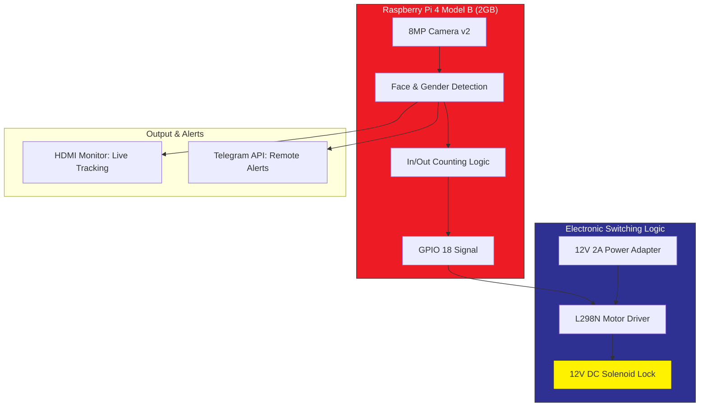

To make your GitHub repository look like a professional B.Tech AIML project, your **README.md** should be clear, organized, and technical. 

You can copy and paste the entire block below directly into your GitHub `README.md` file.

---

#  Smart Door: Real-Time Face Recognition & Gender Detection

This is an automated security system built using a **Raspberry Pi 4** that uses computer vision to identify authorized faces and detect gender before granting access via an electronic **12V Solenoid Lock**.

## Key Features
* **Real-Time Face Recognition:** Identifies authorized users with high accuracy using OpenCV.
* **Gender Classification:** Analyzes facial features to identify gender in real-time.
* **Automated Entry Control:** Triggers a 12V Solenoid lock using an L298N Motor Driver.
* **Smart Counting:** Keeps a live count of "Total In" and "Total Out" individuals.
* **Telegram Integration:** Sends instant alerts and snapshots to a linked Telegram bot when a face is detected.

---

## System Architecture

The following diagram represents the logical flow of the system, from the camera input to the physical unlocking of the door.



---

##  Hardware Requirements

|     Component         |         Specification         |         Purpose                         |

| **Microcontroller**   | Raspberry Pi 4 Model B (2GB)  | Main processing unit for AI models.     |
| **Camera**            | Raspberry Pi Camera Module v2 | 8MP High-definition image capture.      |
| **Locking Mechanism** |      12V DC Solenoid Lock     | Physical security latch.                |
| **Switching Unit**    |      L298N Motor Driver       | Interface between 3.3V Pi and 12V Lock. |
| **Power Supply**      |      12V 2A DC Adapter        | Dedicated power for the solenoid lock.  |
| **Storage**           |     64GB Samsung EVO Plus     | OS and local model storage.             |

---

##  Software Stack
* **OS:** Raspberry Pi OS Lite (64-bit)
* **Language:** Python 3.x
* **Libraries:** * `OpenCV` (Image processing)
    * `TensorFlow Lite` (Model inference)
    * `GPIOZero` (Hardware control)
    * `python-telegram-bot` (Notifications)

---

##  Wiring Diagram

To ensure safe operation and protect the Raspberry Pi from high voltage, the following pin configuration is used:

1.  **Pi GPIO 18** (Physical Pin 12) ➡️ **L298N IN1**
2.  **Pi GND** (Physical Pin 6) ➡️ **L298N GND** (Common Ground)
3.  **12V Adapter (+)** ➡️ **L298N 12V Terminal**
4.  **12V Adapter (-)** ➡️ **L298N GND**
5.  **Solenoid Wires** ➡️ **L298N OUT1 & OUT2**


---

##  Installation & Usage

1.  **Clone the Repository:**
    ```bash
    git clone https://github.com/vinayteja11/Smart-Door-Face-Recognition.git
    cd Smart-Door-Face-Recognition
    ```

2.  **Install Dependencies:**
    ```bash
    pip install opencv-python gpiozero
    ```

3.  **Run the System:**
    ```bash
    python facial_recognition_hardware.py
    ```

---

##  Author
**Vinay Teja** *B.Tech Final Year Student | AIML Branch* *Hyderabad, Telangana*

---
